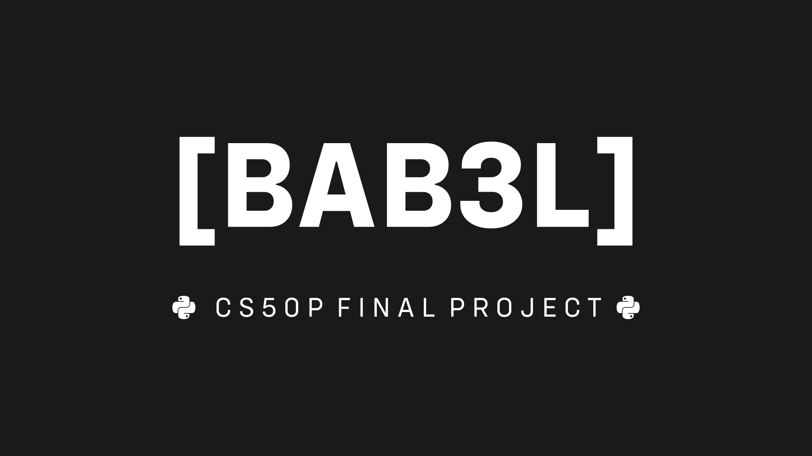

# [BAB3L]
#### Video Demo:  https://youtu.be/EobsJXZoHCc
#### Description:
In a world increasingly full of distractions and advertisements above, below and around the texts we want to read, an answer emerges from chaos... Not to confuse, but to enlighten: BAB3L!

## Who Am I?
My name is [Matheus Antunes](https://github.com/AmigoDaLua), I am a front-end developer from Rio de Janeiro, Brazil, and **BAB3L** is my final project for CS50P.

## What is BAB3L?
BAB3L is a simple tool to read the text content of a html page right on the terminal, no ads and no distractions, just the peace an quiet of the letters on the screen.

## How does it work?
Just enter your url in the input field and click "go!": In no time your text will appear in the text area. Wanna read it right now on BAB3L? Do it! Wanna save it for later? Just click "copy your text" and paste it to your favorite text processor! You name it!

## The python libraries behind the scenes
All of this is made possible thanks to the [html2text](https://pypi.org/project/html2text/) and [textual](https://github.com/Textualize/rich) libraries: the former does the hard work of converting the html page into a readable version in markdown format, while the latter is what enabled the quick and *painless* development of this super cool graphical interface.

* [requests](https://pypi.org/project/requests/) was also crucial for the app to work, because it handles the http requests! For some reason, I forgot to mention it before. *Sorry, requests!*

## The goal
BAB3L was born to be something simple but really useful! I imagined the most user-friendly interface possible and invested in putting in all the features that seemed essential.

* The "clear url field" button, for example, wasn't in the original design of the button panel. But it proved to be an obvious necessity when I realized that it would be terribly annoying to manually delete long urls (or deal with exceptions):

So, if you're like me and find it difficult to deal with pages polluted by ads and too much information, BAB3L is the answer you've been looking for! 

## Last words
The CS50P course was an amazing experience. I learned A LOT and I strongly recommend it to anyone who wants to learn Programming or Python. Or both!

**THIS...
WAS...
BAB3L!**

